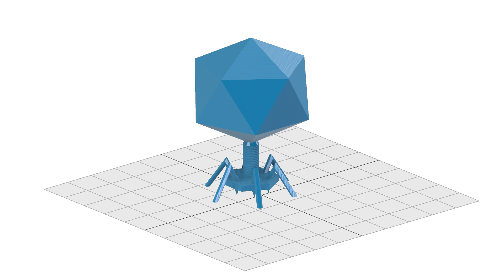
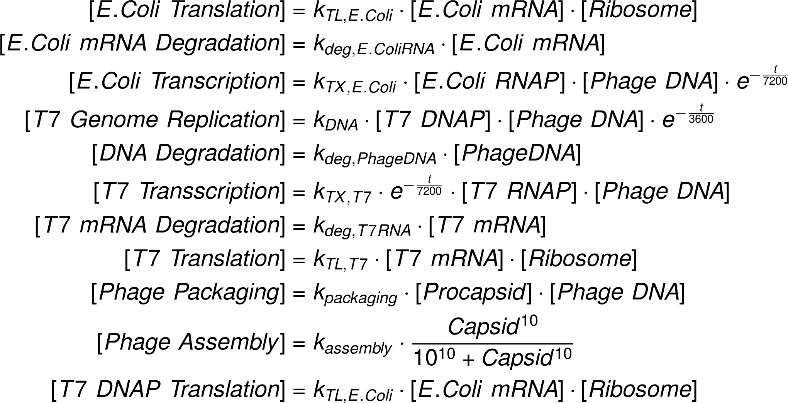
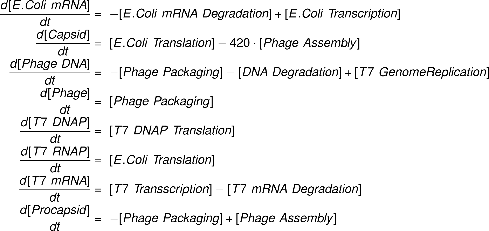

# iGEM Munich 2018 Repository
This is an additional repository for many files which were created during the 2018 iGEM Munich season. It consists of three parts:
- _PhageCAD:_ Some CAD files to 3D-Print phage models
- _DropletVaporizer:_ CAD files to build an easy droplet vaporizer to produce alginate beads (in our case with phages in it) via 3D-printing
- _Model:_ Some parts of the iGEM Munich 2018 model. A simulation, how phages would reproduce inside a cell with respect to degradation an other intrinsic processes

## PhageCAD

The phage model looks like this:

## Droplet Vaporizer
### Introduction

Phactory yields phages with toxicity levels that allow for oral administration to the patient. However, oral delivery requires protection of the phages from rapid degradation in the acidic gastric juice, while direct intravenous application requires additional purification steps. To overcome these hurdles, we prototyped two 3D-printed fluidic devices that each can be assembled for less than $5.

For oral application, we built the Phagecapsulator, a nozzle to encapsulate the phages in monodisperse calcium-alginate microspheres that protect them in the stomach. For intravenous administration, we can purify the bacteriophages from the remaining cell-extract via fractionation in a pressure-driven size-exclusion Phactory-Purificator filter system.

### Phage-Encapsulator
#### Motivation

As in many manufacturing processes, packaging of our produced phages is the final step of Phactory. Packaging provides long-term storability and ensures a clean and safe product for patients. Lacking access to commercial bioencapsulation devices such as the Inotech Encapsulator IER-50, available at $10,000, we engineered Phage-Encapsulator, an affordable device for encapsulating phages in monodisperse alginate spheres (1).

Requiring only standard parts, phage solution, alginate and compressed air, Phage-Encapsulator makes phage packaging accessible to non-specialized laboratories. The throughput is sufficient to produce encapsulated phages for oral application on-site in less than 2 hours.
Overall design

The core part of the Phage-Encapsulator consists of a dispensing tip that is continuously fed with phage containing alginate solution by a syringe pump. The dispensing tip is surrounded by a chamber connected to a compressed air supply to create a steady stream of air around the tip that shears off a jet of monodisperse droplets, smaller than the diameter of the tip. The alginate droplets are sprayed into a Calcium-Chloride bath where the rapid crosslinking reaction occurs.

   
  
 

#### Individual Parts:
##### Alginate Solution

The negatively charged polysaccharide alginate is commonly used for cell encapsulation or as food additive. Alginate undergoes strong shrinking when the pH of the environment drops below its pKa (2). Due to its pKa of ~3.5 this is the case in gastric fluid with a pH of 1 – 2. These properties render alginate spheres an ideal delivery substrate, protecting the phages in the stomach and releasing them in the basic milieu of the intestinal tract. As a tradeoff between alginate viscosity and gel strength, we found that a mixture of 1.8% high viscosity alginate (Art.-No. 9180.1, ROTH) and 0.2 low viscosity alginate (A1112, Sigma Aldrich) represents a good compromise.

##### Nozzle
Our final design of the nozzle is shown in Interactive Figure 1. It consists of a chamber that can be connected to a pressure supply via a universial tube adapter. Consisting of two parts, the nozzle does not get in contact with the phage solution, so it can be reused. The dispensing tip can be easily inserted via a Luer-lock adapter and lines up precisely with the nozzle orifice. A centering aid is located behind the orifice to reduce variances in cannula alignment, while the air stream is not disturbed unequally by its symmetric shape. At a given air pressure, the orifice diameter determines the velocity of the air stream and consequently the droplet diameter.

##### Calcium bath
Rapid gelation of the phage-containing alginate droplets was obtained in a 10 mM MgSO4 solution with 1.8% CaCl2. Aggregation of alginate droplets was prevented by continuous stirring during droplet generation with a magnet stirrer.

##### Syringe pump
In our experiments we used a commercial syringe pump from TSE Systems (type 540060) to create a continuous alginate stream. We designed our nozzle to be compatible with other types of syringe pumps, including open-source solutions.

##### Pressure supply
As a pressure supply we used the house gas line, reduced to 1 bar. If not available, the universial tube adapter ensures compatibility to alternative pressure supplies, including portable, open-source solutions.
Part List

- syringe (1ml Braun Omnifix)
- dispensing Tip (ID 0.51mm, Vieweg)
- syringe pump
- pressure supply
- pneumatic tubing
- 4x M3x20 screws + nuts
- 3D printed nozzle (PMMA)

#### Results

Our results show that after 1 hour incubation in simulated gastric fluid, active phages are successfully released in simulated intestinal fluid. Within the limited time frame of the iGEM competition we were able to show storability of these alginate spheres with constant phage activity at 4°C for four weeks, while stability for several months was shown in the literature (3).

##### Droplets are Monodisperse

  
   
  

    Alginate composition of 1.8 % Alginate and 0.2 % low-viscosity Alginate delivers spherical Alginate microspheres.
  

 

  
   
  

    Alginate encapsulated phages, DNA stained with SYBR Gold.
  

 
In order to achieve defined phage concentrations and therefore defined doses, we optimized the monodispersity of our alginate droplets.

In our initial attempts to create alginate droplets the size within a batch often varied significantly. Additionally, due to aggregation a lot of droplets were lost. Optimization of parameters such as flow rate, alginate concentration and N2 pressure led to an increase of monodispersity for all tested sizes (50-300 μm). Specifically, an alginate concentration of 1.8 % alginate and 0.2 % low-viscosity alginate proved to be ideal. Pressure and flow rate determine the droplet sizes.

  
 
Monodispersity of alginate droplets with three different diameters before and after optimization of the hardware device.

 

##### Bacteriophages Encapsulated In Alginate Can Withstand Gastric Acid 

The main problem of oral application is the acidic environment in the gastric fluid, necessitating protective measures against degradation. The other requirement of phage protection is the release of functional phages in the intestines. For this reason we compared the behavior of the encapsulated phages and non-encapsulated phages in simulated gastric fluid (SGF) and simulated intenstinal fluid (SIF).

In SGF, the number of active non-encapsulated phages decreases by more than 99.99 % within an hour. This shows the urgent need of a form of protection against degradation to make oral application of bacteriophages possible. As a reference, we used phages that were chemically released by citrate from alginate droplets.

  
 
Non-encapsulated phages are highly degraded within an hour in simulated gastric fluid.

In comparison, the encapsulated phages were tested in SGF for the same time as the non-encapsulated phages. Afterwards, the same droplets were exposed for two hours to simulated intestinal fluid to test the release of functional bacteriophages in this environment.

The encapsulated phages were barely released in an hour of exposure to SGF. After transfering the capsules to SIF the number of active phages reached that of the undegraded reference. This indicates that the encapsulation of bacteriophages in alginate capsules enables the possibility of an oral application. Further experiments could test the alginate capsules in an animal model system.

  
 
A small amount of encapsulated phages are released in SGF.  In SIF, functional phages are released in high concentration.

 

### References
<ol>
<li> <a href=https://doi.org/10.1016/j.biomaterials.2009.07.034>Chan, A. W., &amp; Neufeld, R. J. (2009). Modeling the controllable pH-responsive swelling and pore size of networked alginate based biomaterials. Biomaterials, 30(30), 6119–6129. </a></li>
<li> <a href=https://doi.org/10.1016/j.ab.2007.10.045>Kwon, Y.-C., Hahn, G.-H., Huh, K. M., &amp; Kim, D.-M. (2008). Synthesis of functional proteins using Escherichia coli extract entrapped in calcium alginate microbeads. Analytical Biochemistry, 373(2), 192–196. </a></li>
<li> <a href=https://doi.org/10.1038/srep41441>Colom, J., Cano-Sarabia, M., Otero, J., Aríñez-Soriano, J., Cortés, P., Maspoch, D., &amp; Llagostera, M. (2017). Microencapsulation with alginate/CaCO3: A strategy for improved phage therapy. Scientific Reports, 7(1). </a></li>
</ol>

## Model

Visit  for more information regarding the model.
### Cell-free Biosynthesis of Bacteriophages

The seemingly simple experimental procedures of the optimized framework of Phactory may lead to the false impression that cell-free biosynthesis of bacteriophages is a trivial process. In fact, the production of phages represents one of the most complicated self-assembly processes that have been realized in a synthetic context.

We chose the T7 phage as a model system for cell-free phage production, because it is well characterized in the literature and our experiments. The phage assembly reaction resembles a temporally orchestrated process, which involves the expression of more than 40 proteins. This genetic program, encoded by the phage genome, is executed in a test tube containing hundreds of proteins, ribosomes, tRNAs and small molecules.

Due to the complexity of this process, variations in the quality of our cell extract cause irreproducible results. To optimize bacteriophage titers, we created a model based on ordinary differential equations to understand the essential features of a phage assembly reaction in a quantitative manner.

### Assumptions and Parameter Estimation

A phage assembly reaction follows a temporal program (1). First, the genes controlled by E. coli promoters, including the T7 DNA and RNA polymerase are expressed. Once the T7 RNA polymerase is present, the transcription of genes under a T7 promoter, e.g. the capsid proteins, starts. Our experiments revealed that simultaneously the phage genome being is replicated by the T7 DNA polymerase. As soon as a sufficient amount of capsid proteins is produced, they self-assemble to form empty phage capsids. In a final step the phage genome is packed into the empty capsids forming functional phages. In the following paragraphs we develop a set of ordinary differential equations that describe the phage assembly reaction, give analytical results where appropriate and estimate realistic reaction rate constants.

The complete set of model equations is shown below. 
#### Reaction Fluxes

#### Ordinary Differential Equation System

### Results

We used the MATLAB SimBiology toolbox to analyze the reactions numerically.

#### Phage Assembly Follows a Temporal Program

Evaluating our ODE model we can now follow the time traces of each reaction species in our system. Looking at the mRNA levels, it becomes evident that mRNA transcribed by E. coli RNA polymerase is produced instantly and rapidly reaches a low steady-state level. mRNA transcribed by the T7 RNA polymerase is produced after a time delay and reaches a much higher steady-state level, consistent with the faster transcription rate. Both mRNA levels decrease as the steady state level decreases due to the finite lifetime of the cell extract.

Following protein levels, we see that production of the T7 DNA and RNA polymerases starts first, while production of the T7 RNA polymerase controlled capsid proteins sets in later. When the free capsid proteins exceed the critical concentration __Kc__ , they start to be assembled into full capsids and the free capsid protein concentration approaches a steady-state. All protein levels approach a final level at the end of the reaction.

  
 
mRNA levels over time in the cell-extract. before and after optimization of the hardware device.

 

Further, it is instructive to inspect the time traces of free DNA and fully packed active phages. As soon as sufficient T7 DNA polymerase is present, the phage genomes are being amplified to approximately 10 times the initial level. The assembly and packing of functional phages, however, only kicks in after an initial time delay. Importantly, this allows the genome to be freely transcribed and replicated, before the negative feedback introduced by DNA packing, impedes further phage production.

  
 
T7 polymerase generation by the E.coli in-house polymerase

 

  
 
Phage production and DNA levels over time

 

#### DNA Stability

To analyze the influence of DNA stability, we screened a range of DNA degradation rates as shown in the figure on the right. Phages are produced until a critical degradation rate of __&delta;g,c &asymp; 2 &sdot; 10-4__ is reached. This results in lower concentrations of proteins in downstream reactions and resultingly prohibits the formation of procapsids.

  
 
Influence of DNA degradation on the phage production

 

 
 
#### Impact of Positive Feedback via DNA Replication

To evaluate the influence of the positive feedback loop introduced by DNA replication, we conducted experiments with and without addition of dNTPs to the reaction mixture. With our model we can simulate this experiment by setting the DNA replication rate to zero.

The bar plot on the right shows enhanced phage packaging of over one decade by the integrated feedback loop of the T7 DNA polymerase.
 
 

  
 
Evaluation of DNA polymerase in the phage production.

 

### Conclusions

Based on the results, we identified that enhancing DNA stability and maximizing protein yield are the most relevant parameters to improve phage titers. After optimizing our protocols accordingly, we reached __107__ phages per __10 µL__ reaction - sufficient to treat up to 10 patients.

### References
<ol>
<li id="ref_1"> <a href=https://pubs.acs.org/doi/abs/10.1021/sb300049p>  Shin, J., Jardine, P., &amp; Noireaux, V. (2012). Genome Replication, Synthesis, and Assembly of the Bacteriophage T7 in a Single Cell-Free Reaction. ACS Synthetic Biology, 1(9), 408–413.</a></li>
<li id="ref_2"> <a href=https://www.jove.com/video/56144/synthesis-infectious-bacteriophages-an-e-coli-based-cell-free>  Rustad, M., Eastlund, A., Marshall, R., Jardine, P., &amp; Noireaux, V. (2017). Synthesis of infectious bacteriophages in an E. coli-based cell-free expression system.
</a></li>
<li id="ref_3"> <a href=https://doi.org/10.1103/PhysRevLett.106.048104>  Karzbrun, E., Shin, J., Bar-Ziv, R. H., &amp; Noireaux, V. (2011). Coarse-grained dynamics of protein synthesis in a cell-free system. Physical Review Letters, 106(4).</a></li>
<li id="ref_4"> <a href=https://doi.org/10.1021/sb400203p>Siegal-Gaskins, D., Tuza, Z. A., Kim, J., Noireaux, V., &amp; Murray, R. M. (2014). Gene Circuit Performance Characterization and Resource Usage in a Cell-Free “Breadboard.” ACS Synthetic Biology, 3(6), 416–425. </a></li>
<li id="ref_5"> <a href=https://doi.org/10.1021/sb400131a>
Sun, Z. Z., Yeung, E., Hayes, C. A., Noireaux, V., &amp; Murray, R. M. (2014). Linear DNA for rapid prototyping of synthetic biological circuits in an Escherichia coli based TX-TL cell-free system. ACS Synthetic Biology, 3(6), 387–397.  </a></li>

<li id="ref_6"> <a href=http://www.jbc.org/content/286/1/234.full>Ionel, A., Velázquez-Muriel, J. A., Luque, D., Cuervo, A., Castón, J. R., Valpuesta, J. M., … Carrascosa, J. L. (2011). Molecular Rearrangements Involved in the Capsid Shell Maturation of Bacteriophage T7. Journal of Biological Chemistry, 286(1), 234–242. </a></li>
<li id="ref_7"> <a href=https://books.google.de/books?hl=de&amp;lr=&amp;id=vgyBJbtNOcoC&amp;oi=fnd&amp;pg=PP1&amp;dq=israelachvili&amp;ots=_PQtchA1Q9&amp;sig=Bw7OdRovpmTt5FKFaZCesKrPM18#v=onepage&amp;q=israelachvili&amp;f=false>Israelachvili, J. N. (2011). Intermolecular and surface forces. Academic press.</a></li>

</ol>
